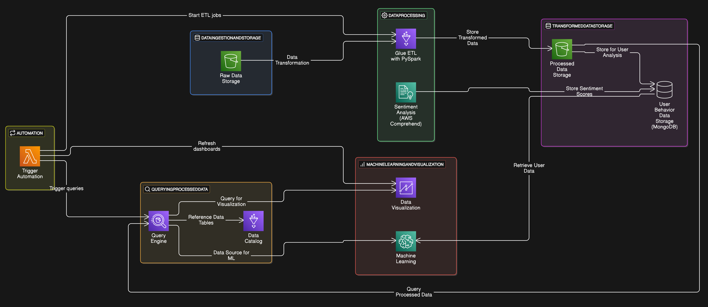

# Aws Athena Big Data Project for querying covid 19 data

### Description: The Aws Athena Big Data Project on COVID-19 involves leveraging serverless querying to analyze vast datasets related to the pandemic. Utilizing Athena's SQL capabilities on stored COVID-19 data in S3, this project enables seamless ad-hoc analysis, empowering researchers and analysts to extract valuable insights efficiently. The serverless architecture ensures cost-effectiveness, making it an agile and scalable solution for querying and gaining meaningful information from diverse COVID-19 datasets.

### Project Architecture:
