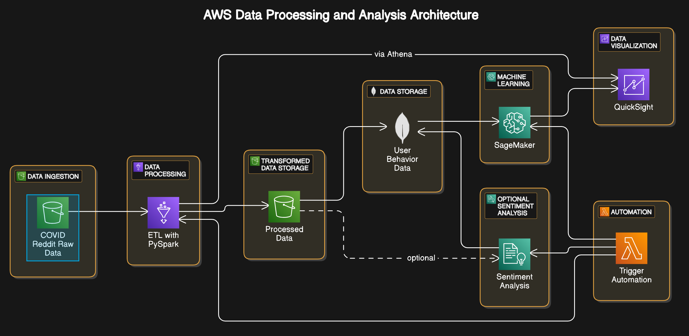

# AWS Data Processing and Analysis Architecture for User Behavior Analysis Project

## Data Source: Reddit Covid 19 Dataset

### Description: This project analyzes user behavior on Reddit during the COVID-19 pandemic using AWS services. It leverages AWS Glue with PySpark for ETL, MongoDB for data storage, Amazon SageMaker for machine learning, and AWS QuickSight for data visualization.

### Project Architecture:


#### The architecture consists of the following components:

1. **Data Ingestion**: Stores the raw COVID-19 Reddit data in Amazon S3.
2. **Data Processing (ETL)**: Uses AWS Glue with PySpark to clean and preprocess the data.
3. **Transformed Data Storage**: Stores processed data in another S3 bucket.
4. **Data Storage for User Behavior**: Stores user behavior data in MongoDB Atlas for flexible querying.
5. **Machine Learning for Behavior Modeling**: Uses Amazon SageMaker for feature engineering and training ML models.
6. **Optional Sentiment Analysis**: Uses AWS Comprehend to analyze sentiment in comments.
7. **Data Visualization**: Visualizes the results in Amazon QuickSight.
8. **Automation**: AWS Lambda automates the pipeline, triggering various tasks based on conditions.

### Project Structure

```plaintext
├── data/                         # Data folder
├── notebooks/                    # Jupyter notebooks for data exploration and preprocessing
├── scripts/                      # Scripts for data processing, analysis, and ML models
├── README.md                     # Project documentation
└── architecture_diagram.png      # Architecture diagram
